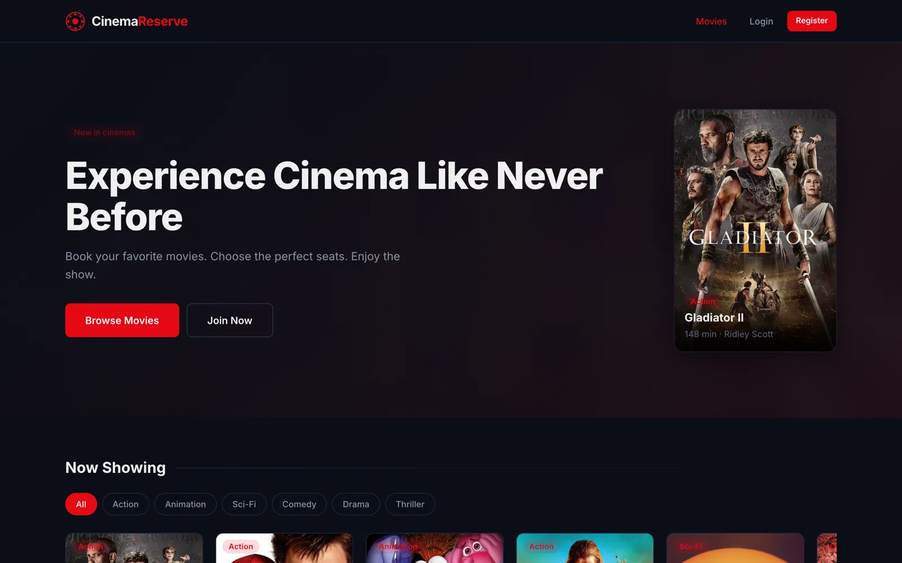
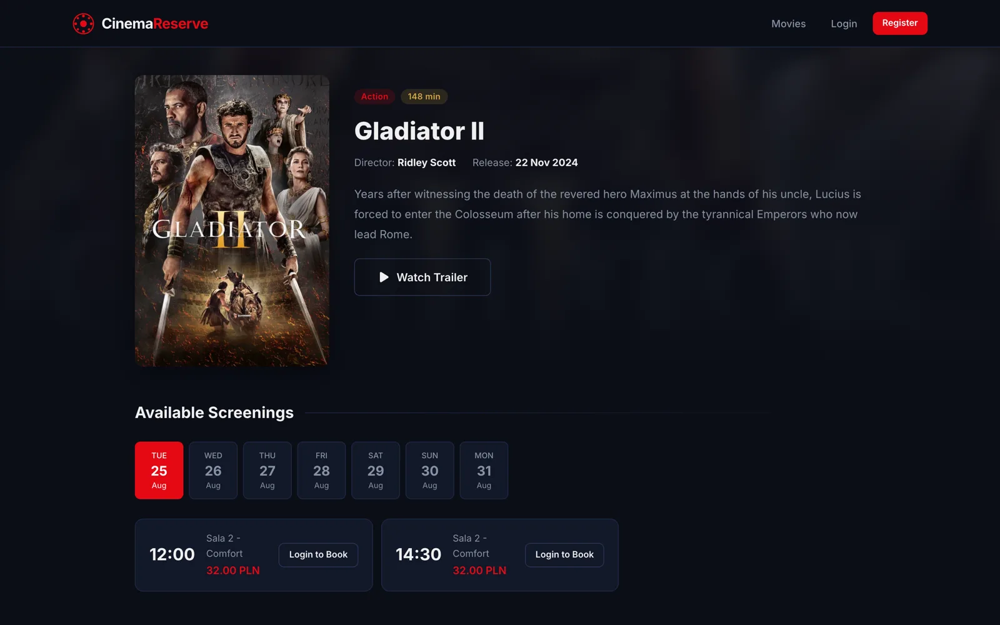
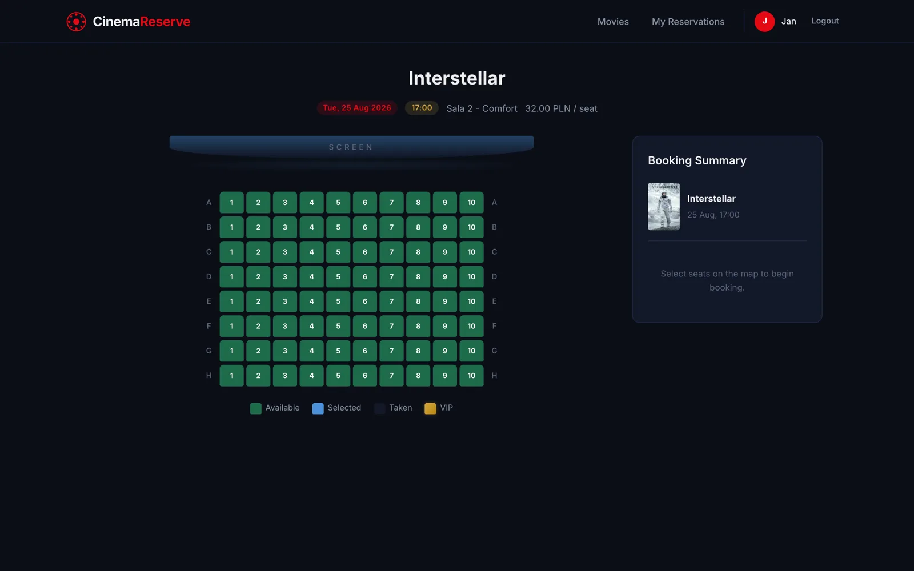
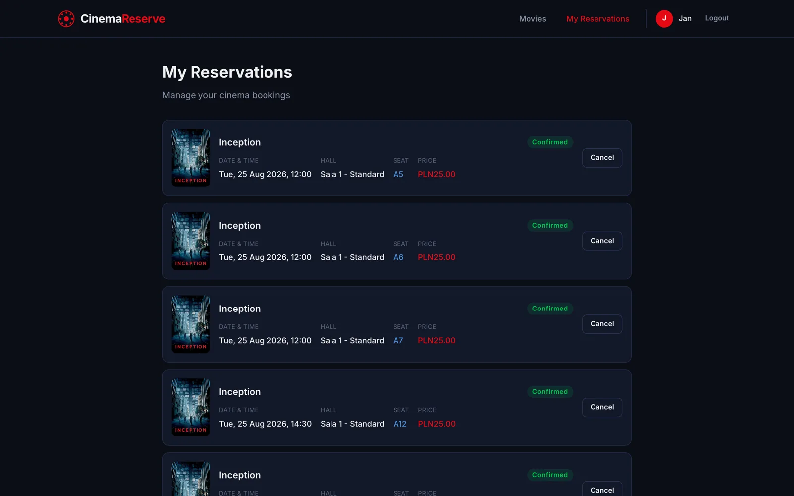
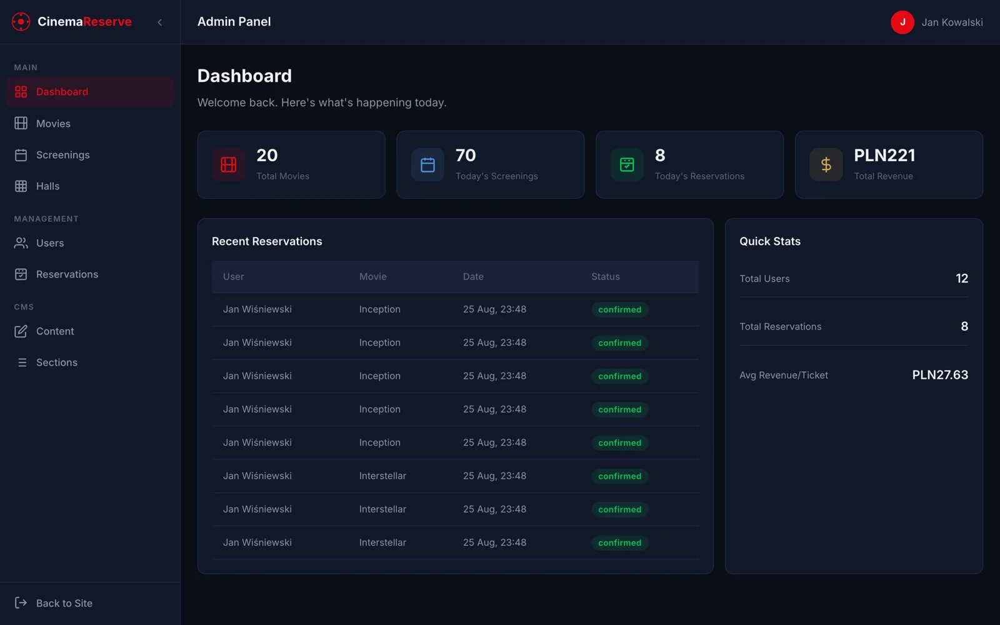
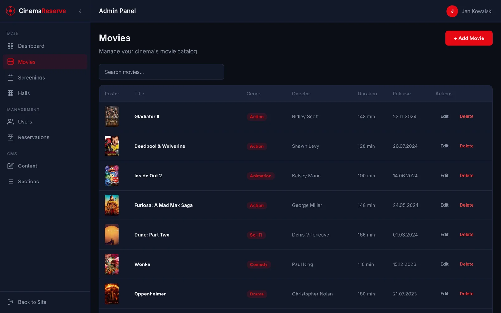
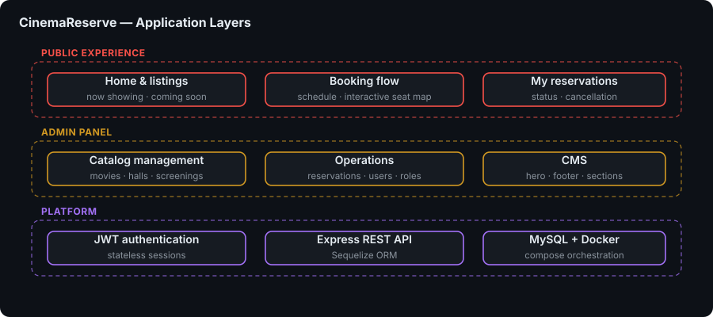
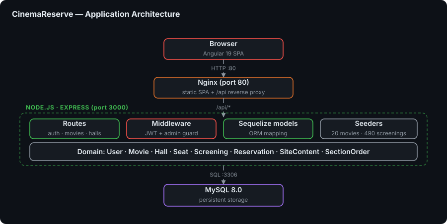

# CinemaReserve

> 🚀 **Full-Stack Cinema Seat Reservation Platform** - Book cinema seats in real time with a complete CMS-driven admin panel

**CinemaReserve** is a full-stack cinema booking application inspired by real-world systems such as Multikino and Helios. Visitors browse the "Now Showing" catalogue, pick a screening, choose seats on an interactive colour-coded seat map, and manage their own reservations. Administrators get a Berry-inspired panel covering movies, screenings, halls, users, reservations and CMS content.

The project demonstrates a modern **Angular 19** standalone-component frontend, a **Node.js / Express** REST API backed by **Sequelize** and **MySQL 8**, JWT-based authentication, and a fully containerized deployment where **Nginx** serves the SPA and reverse-proxies API traffic.


---

## 🎯 Key Features

### Public Pages

- 🏠 **Home** — Hero banner, "Now Showing" movie grid with hover effects, "Coming Soon" section and promo banner
- 🎬 **Movie Detail** — Full-width backdrop with the screening schedule grouped by date tabs
- 💺 **Seat Selection** — Interactive seat map (colour-coded: free / taken / selected / VIP) with a live booking summary sidebar
- 🎟️ **My Reservations** — Card-based reservation list with status badges and a cancel option
- 🔐 **Auth** — Split-screen login and register pages backed by JWT authentication

### Admin Panel (Berry-inspired)

- 📊 **Dashboard** — Four stat cards, recent reservations table and quick stats
- 🎥 **Movies** — Full CRUD with search, poster preview and inline editing
- 🕒 **Screenings** — Create and delete screenings using movie and hall selects
- 🏛️ **Halls** — Card grid with seat statistics, create and delete
- 👥 **Users** — User table with inline role changes (user / admin)
- 📋 **Reservations** — All reservations with status, search and date filters
- 📝 **CMS Content** — Edit hero titles, footer text and promo content
- 🧱 **Sections** — Reorder and toggle the visibility of home page sections

### Across the App

- 📱 **Fully Responsive** — Tested from 375px to 1440px
- 🗂️ **Collapsible Admin Sidebar** — With a mobile drawer
- 🧩 **CMS-Driven Content** — Hero text, footer and promotions editable without a redeploy
- 🍿 **Real Catalogue Data** — 20 real movies with TMDB poster images

---

## 🖼️ Screenshots

| Home — hero & now showing | Movie detail — screening schedule |
|---|---|
| [](docs/screenshots/home.webp) | [](docs/screenshots/movie-detail.webp) |

| Seat selection — interactive map | My reservations |
|---|---|
| [](docs/screenshots/seat-selection.webp) | [](docs/screenshots/my-reservations.webp) |

| Admin dashboard | Admin — movie management |
|---|---|
| [](docs/screenshots/admin-dashboard.webp) | [](docs/screenshots/admin-movies.webp) |

> Captured from the running Docker stack with the bundled seed data (20 movies, 12 users, 3 halls, 490 screenings) plus a few sample reservations.

---

## 🏗️ Architecture

### Application Layer



### Application Architecture



Request flow at a glance:

```
Browser → Nginx (port 80)
            ├── Static files (Angular SPA)
            └── /api/* → Express (port 3000) → MySQL (port 3306)
```

---

## 🧩 Modules / Services

| Service | Description | Stack |
|---|---|---|
| `cinema-frontend` | Angular SPA built to static assets, served by Nginx which also proxies `/api/*` | Angular 19, Tailwind CSS 3, Nginx |
| `cinema-backend` | REST API, JWT auth, reservations, CMS content and admin endpoints | Node.js, Express 4, Sequelize 6 |
| `cinema-db` | Relational store with a health-checked startup gate | MySQL 8.0 |

---

## 🛠️ Technology Stack

### Frontend

- **Angular 19** — standalone components, router, reactive forms
- **TypeScript 5.7**
- **Tailwind CSS 3** — utility-first styling with a custom dark cinema theme
- **RxJS 7** — reactive data flow
- **Karma** + **Jasmine** — unit test runner

### Backend

- **Node.js** with **Express 4**
- **Sequelize 6** ORM over **mysql2**
- **jsonwebtoken** — JWT issuing and verification
- **bcryptjs** — password hashing
- **cors**, **dotenv** — CORS handling and environment configuration
- **nodemon** — development auto-reload

### Infrastructure

- **MySQL 8.0** — relational database with a Docker healthcheck
- **Docker** & **Docker Compose** — multi-service orchestration
- **Nginx** — static asset serving and API reverse proxy

---

## 🚀 Getting Started

### Prerequisites

- [Docker Desktop](https://www.docker.com/products/docker-desktop/) installed and running
- For local development without Docker: **Node.js 18+** and a running **MySQL 8** instance

### 1. Clone the Repository

```bash
git clone https://github.com/dawidolko/CinemaReserve-Project-Node-Angular.git
cd CinemaReserve-Project-Node-Angular
```

### 2. Install Dependencies

Docker installs everything during the image build. For a local setup:

```bash
cd backend && npm install
cd ../frontend && npm install
```

### 3. Run

With Docker Compose (recommended):

```bash
docker compose -f .tools/docker/docker-compose.yml up --build
```

The app is available at **http://localhost** (port 80). The API is exposed on **http://localhost:3000** and MySQL on **3307**.

> See [.tools/docker/README.md](.tools/docker/README.md) for detailed Docker setup instructions.

Running locally without Docker:

```bash
# Terminal 1 — Backend
cd backend
npm install
npm run seed    # seed the database (requires MySQL running)
npm start       # http://localhost:3000

# Terminal 2 — Frontend
cd frontend
npm install
npx ng serve    # http://localhost:4200
```

Backend environment variables: `DB_HOST`, `DB_PORT`, `DB_NAME`, `DB_USER`, `DB_PASSWORD`, `JWT_SECRET`, `PORT`.

### Seed Accounts

| Email | Password | Role |
|-------|----------|------|
| admin@cinema.pl | Admin123! | Admin |
| manager@cinema.pl | Manager123! | Admin |
| jan.wisniewski@email.pl | User123! | User |

---

## 🔌 API Endpoints

| Method | Endpoint | Auth | Description |
|--------|----------|------|-------------|
| POST | `/api/auth/register` | - | Register new user |
| POST | `/api/auth/login` | - | Login, returns JWT |
| GET | `/api/movies` | - | List all movies |
| GET | `/api/movies/:id` | - | Movie detail with screenings |
| POST | `/api/movies` | Admin | Create movie |
| PUT | `/api/movies/:id` | Admin | Update movie |
| DELETE | `/api/movies/:id` | Admin | Delete movie |
| GET | `/api/halls` | - | List all halls |
| POST | `/api/halls` | Admin | Create hall with seats |
| DELETE | `/api/halls/:id` | Admin | Delete hall |
| GET | `/api/screenings` | - | List all screenings |
| GET | `/api/screenings/:id` | - | Screening with seat availability |
| POST | `/api/screenings` | Admin | Create screening |
| DELETE | `/api/screenings/:id` | Admin | Delete screening |
| GET | `/api/reservations/my` | User | User's reservations |
| POST | `/api/reservations` | User | Create reservation |
| PUT | `/api/reservations/:id/cancel` | User | Cancel reservation |
| GET | `/api/content` | - | CMS content (key-value) |
| PUT | `/api/content/:key` | Admin | Update CMS content |
| GET | `/api/content/sections` | - | Home page sections order |
| PUT | `/api/content/sections` | Admin | Update section order |
| GET | `/api/admin/stats` | Admin | Dashboard statistics |
| GET | `/api/admin/reservations` | Admin | All reservations |
| GET | `/api/admin/users` | Admin | User list |
| PUT | `/api/admin/users/:id/role` | Admin | Change user role |

---

## 🌱 Seed Data

Running `npm run seed` (also executed for the Docker setup) populates the database with:

- **20 movies** with real titles, descriptions, directors and TMDB poster images (Inception, Interstellar, The Dark Knight, Dune: Part Two, Oppenheimer, and more)
- **12 users** (2 admins, 10 regular users)
- **3 halls** (Sala 1: 12x14 seats, Sala 2: 10x12, Sala VIP: 8x10 with VIP rows)
- **490 screenings** spread across 7 days
- **CMS content** (hero title, hero subtitle, footer text, promo text)
- **4 home sections** (hero, now_showing, coming_soon, promo)

---

## 🎨 Styling

The app uses **Tailwind CSS 3** with a custom dark cinema theme:

- Background: `#0b0e17` (dark navy)
- Primary: `#e50914` (cinema red)
- Accent: `#d4a843` (gold for VIP/premium)
- Typography: Inter (Google Fonts)

Global component classes (`.btn`, `.badge`, `.card`, `.form-group`, `.admin-table`) are defined in `styles.scss` using `@layer components` with `@apply`.

---

## 📁 Project Structure

```
CinemaReserve-Project-Node-Angular/
├── 📁 .tools/docker/
│   ├── 🐳 docker-compose.yml      # Orchestrates all services
│   ├── 🐳 Dockerfile.backend      # Node.js Express container
│   ├── 🐳 Dockerfile.frontend     # Angular build → Nginx container
│   ├── ⚙️ nginx.conf              # Nginx reverse proxy config
│   └── 📖 README.md               # Docker setup instructions
├── 📁 backend/
│   ├── src/
│   │   ├── config/                # Sequelize database connection
│   │   ├── middleware/            # JWT auth & admin guard
│   │   ├── models/                # User, Movie, Hall, Seat, Screening,
│   │   │                          # Reservation, SiteContent, SectionOrder
│   │   ├── routes/                # auth, movies, halls, screenings,
│   │   │                          # reservations, content, admin
│   │   ├── seeders/               # Database seed script
│   │   ├── app.js                 # Express app setup
│   │   └── server.js              # Server entry point
│   └── 📦 package.json
├── 📁 frontend/
│   ├── src/
│   │   ├── app/
│   │   │   ├── core/              # Services, guards, interceptors
│   │   │   ├── shared/components/ # Navbar, footer
│   │   │   └── pages/             # home, movie-detail, seat-select, login,
│   │   │                          # register, profile, my-reservations, admin/*
│   │   ├── 🎨 styles.scss         # Global styles with Tailwind directives
│   │   └── index.html
│   ├── ⚙️ tailwind.config.js      # Custom cinema theme
│   └── 📦 package.json
├── 📁 docs/diagrams/              # Architecture diagrams (SVG)
└── 📖 README.md                   # Project documentation
```

---

## 📄 License

This project is open source and available under the [MIT License](LICENSE).

---

## 👨‍💻 Author

Created by **[Dawid Olko](https://github.com/dawidolko)**

- **Website** — [dawidolko.pl](https://dawidolko.pl/)
- **LinkedIn** — [@dawidolko](https://www.linkedin.com/in/dawidolko/)
